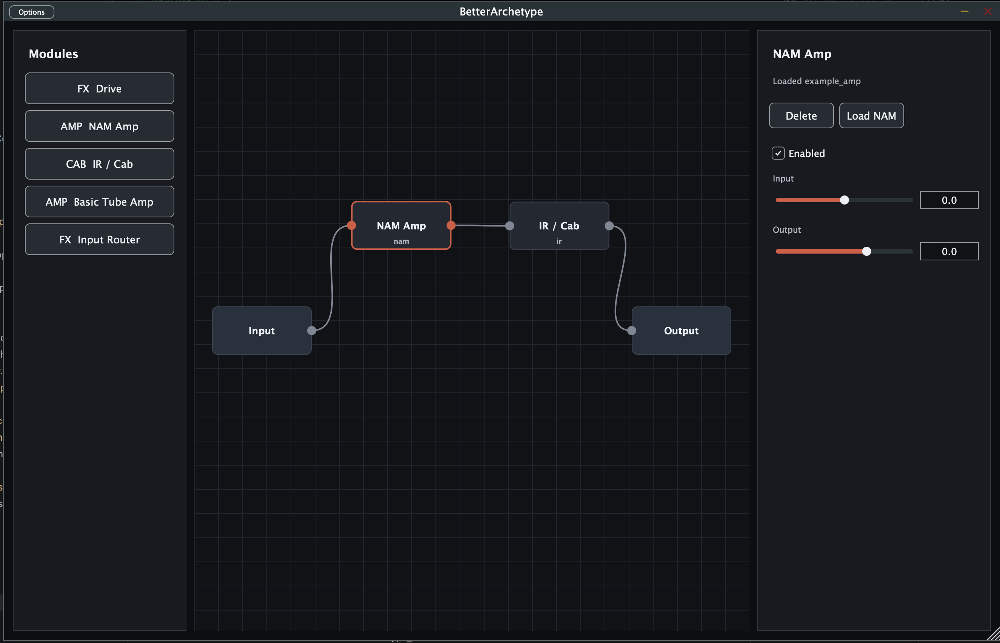

# BetterArchetype

Student project / prototype. Do not take it too seriously.

A small JUCE/C++ project for a modular guitar audio processor.
The core idea is a free node graph, not a fixed Amp/Cab/Drive chain and not a slot system.

## How It Works

Audio runs through `juce::AudioProcessorGraph`.
There are fixed `Input` and `Output` nodes.
Modules can be added as nodes between them and connected freely.

Example:

```text
Input -> Drive -> NAM Amp -> IR / Cab -> Output
```



## Important Files

- `CMakeLists.txt`: Build setup, JUCE plugin formats, source files and defines.
- `src/main.cpp`: JUCE entry point.
- `src/core/GraphAudioProcessor.*`: Audio graph, nodes, connections, and project state save/load.
- `src/audio/graph/GraphTypes.h`: Shared types for nodes, connections, modules and controls.
- `src/audio/graph/ModuleRegistry.*`: List of available modules and factory for creating them.
- `src/audio/graph/AssetPaths.h`: Finds the `assets` folder, for example `example_amp.nam`.
- `src/audio/modules/ModuleProcessor.*`: Base class for all audio modules.
- `src/audio/modules/DriveProcessor.*`: Simple drive module.
- `src/audio/modules/NAMProcessor.*`: NAM amp module, loads `assets/example_amp.nam` by default.
- `src/audio/modules/IRCabProcessor.*`: IR/Cab module with a small convolver.
- `src/audio/modules/AmpProcessor.*`: Simple basic amp module.
- `src/audio/modules/RouterProcessor.*`: Mono router, copies left to right.
- `src/gui/*`: Module browser, node canvas and parameter/control panel.

The GUI, comments and this README were generated by AI. This sentence was not.

## Adding A New Module

1. Derive from `AudioModuleProcessor`.
2. Return a `ModuleDescriptor` with name, category and parameters.
3. Register the module in `ModuleRegistry.cpp`.

The GUI reads parameters from the descriptor. Simple modules do not need a custom panel.

## Clone
```bash
git clone --recurse-submodules https://github.com/yusufmolla/betterarchetype.git
```

## Build

```bash
cmake -S . -B cmake-build-release -DCMAKE_BUILD_TYPE=Release
cmake --build cmake-build-release --config Release
```

## Creating A Release

Push a version tag to GitHub:

```bash
git tag v0.1.0
git push origin main
git push origin v0.1.0
```

GitHub Actions will build macOS and Windows releases and attach the ZIP files
to a GitHub Release.

## License

BetterArchetype is licensed under AGPL-3.0-or-later.
Third-party code and user-provided audio assets keep their own licenses.
