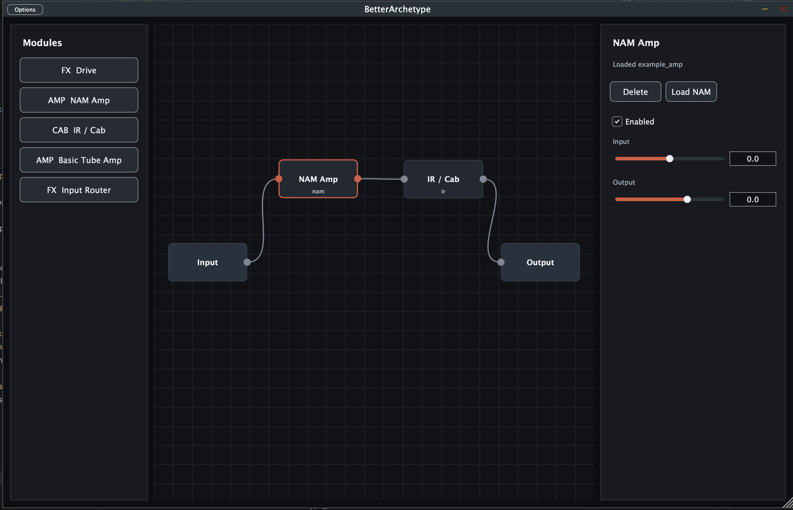
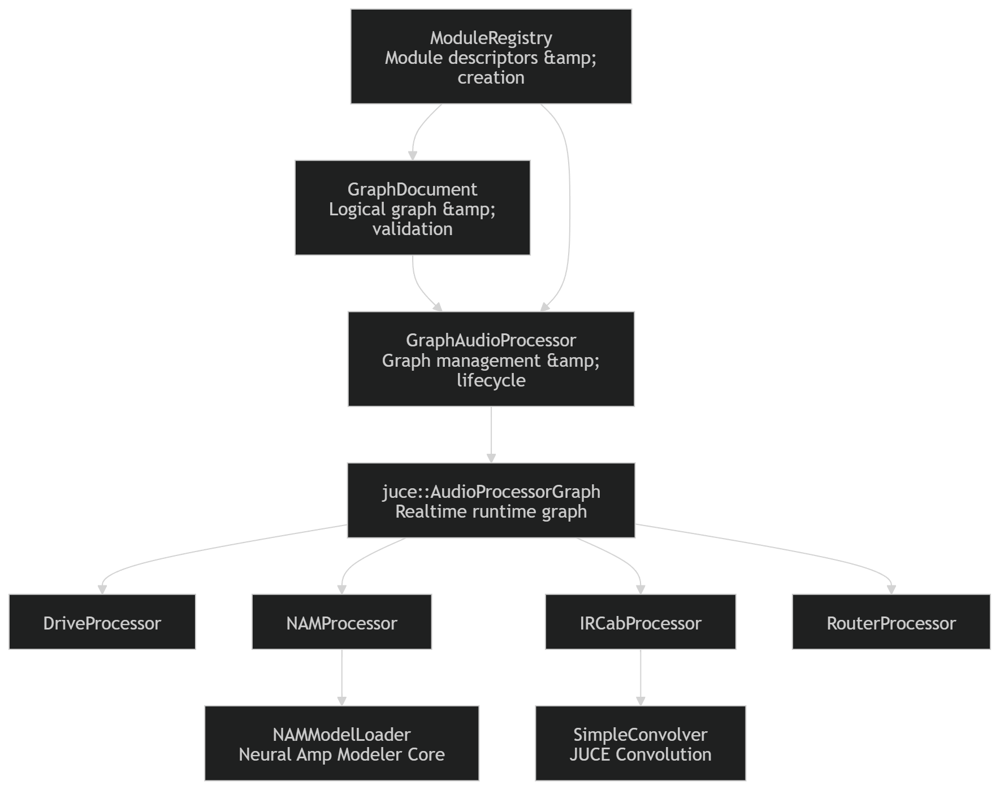
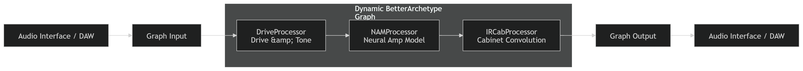

# BetterArchetype

The GUI is completely vibe coded. I have no idea what exactly is going on internally, but it works.
BetterArchetype is a personal C++ project I use to learn more about realtime audio processing, audio plugins and DSP.

It is built with [JUCE](https://juce.com/) and [Neural Amp Modeler Core](https://github.com/sdatkinson/NeuralAmpModelerCore).

The idea is to have a node-based guitar processing graph instead of a fixed signal chain. Modules can be added, connected and reordered freely.

This is not meant to be a finished guitar plugin suite. Most of the work so far went into the graph architecture, state handling, NAM integration and IR processing.



## Current State

Right now BetterArchetype has:

- Dynamic node-based audio graph
- NAM model processing
- IR / cabinet processing
- A simple Drive / Tone module (it sounds horrible though)
- Flexible routing
- Mono and stereo processing
- Plugin state saving / restoring
- VST3 and Standalone builds

The Drive module mainly exists as an example of how another processing module can be added to the graph.

More effects and general polish may come later.

## Current Scope

Currently tested with:

- Windows x64
- 48 kHz host sample rate
- Mono -> Mono
- Stereo -> Stereo
- VST3
- Standalone

NAM processing at other host sample rates is currently outside the tested scope.

## Architecture

The logical graph and the realtime audio graph are kept separate.



`GraphDocument` stores and validates the logical graph.

`GraphAudioProcessor` turns that into the `juce::AudioProcessorGraph` used for realtime processing.

The individual processing modules share common state and lifecycle handling through `AudioModuleProcessor`.

More diagrams are available in [`docs/`](docs/README.md).

## Audio Signal Flow

One possible signal chain:



The graph is dynamic, so Drive -> NAM -> IR is only an example.

## Main Parts

- `src/audio/graph/GraphDocument.*`  
  Logical graph and validation.

- `src/core/GraphAudioProcessor.*`  
  Runtime graph, audio lifecycle and state handling.

- `src/audio/modules/NAMProcessor.*`  
  NAM module and asynchronous model loading.

- `src/audio/modules/NAMModelLoader.h`  
  Integration with Neural Amp Modeler Core.

- `src/audio/modules/IRCabProcessor.*`  
  IR / cabinet processing.

- `src/audio/modules/DriveProcessor.*`  
  Simple drive module and example for adding another effect.

## Build

Requirements:

- Windows x64
- CMake 3.22+
- Visual Studio 2022 with C++ tools
- Git

Clone including submodules:

```powershell
git clone --recurse-submodules https://github.com/Yusufmolla/betterarchetype.git
cd betterarchetype
```

Configure:

```powershell
cmake -S . -B build -G "Visual Studio 17 2022" -A x64
```

Build:

```powershell
cmake --build build --config Release
```

This builds the VST3 plugin and Standalone application.

## Tests

```powershell
.\run-tests.ps1 -Configuration Debug
.\run-tests.ps1 -Configuration Release
```

## Dependencies

* [JUCE](https://github.com/juce-framework/JUCE)
* [Neural Amp Modeler Core](https://github.com/sdatkinson/NeuralAmpModelerCore)

Both are included as Git submodules.

## License

AGPL v3.0 or later.

Third-party dependencies and external audio assets keep their respective licenses.
